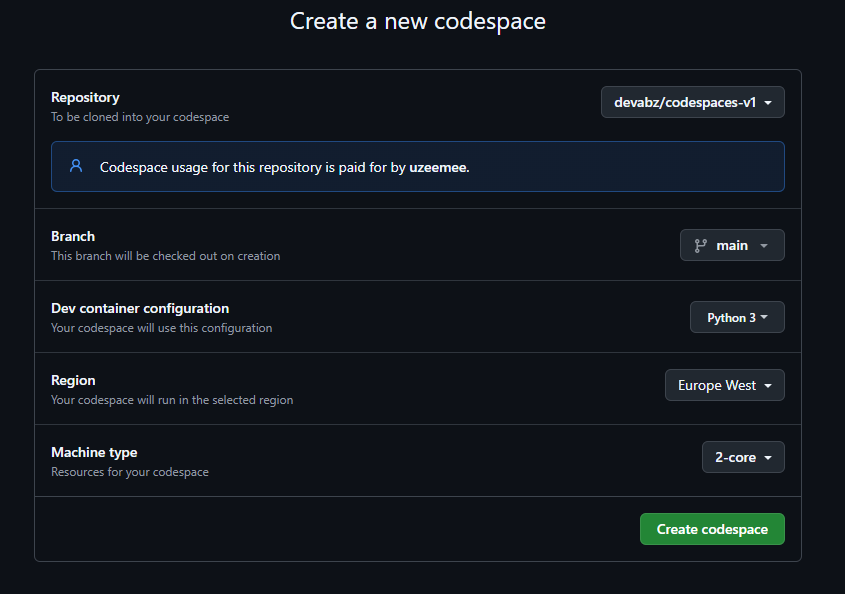

# codespaces-v1

# How To Run
## Create New Codespace
Click the **Open in GitHub Codespaces** button

### Configure your new codespace
Now a new window appears asking you to configure your new codespace. 
1. Select a repository, belonging to your github account, to clone into. You might want to create a new repository for this
2. Select branch or leave as default
3. Select the region which makes sense for you
4. Select a machine type, a 2-core will suffice

### Select Kernel
When running the notebook for the first time, a prompt box appears for you to select the kernel. Follow this steps, mo

Press enter on **Python Environments**

Press enter on **Python 3.9.21**

